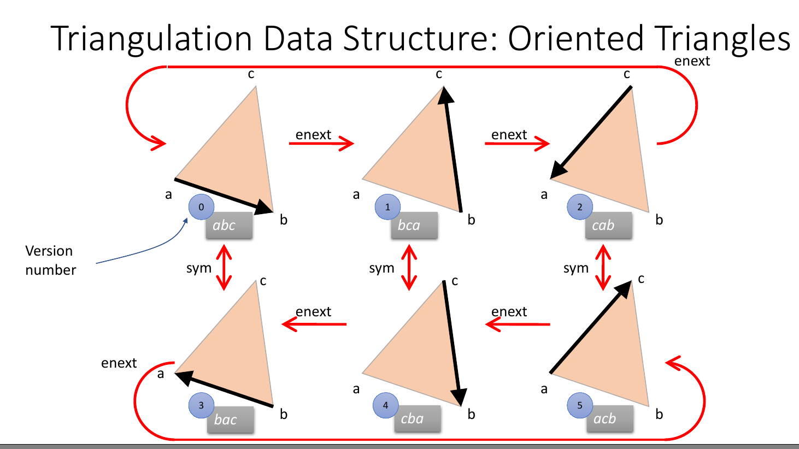

# My mesh processing beginning

* A simple implementation of a copy of the "[triangle-edge](https://graphics.stanford.edu/courses/cs468-02-fall/readings/mucke.ps)" structure
* This one is slightly different though, with the operations looking like below
---
* 